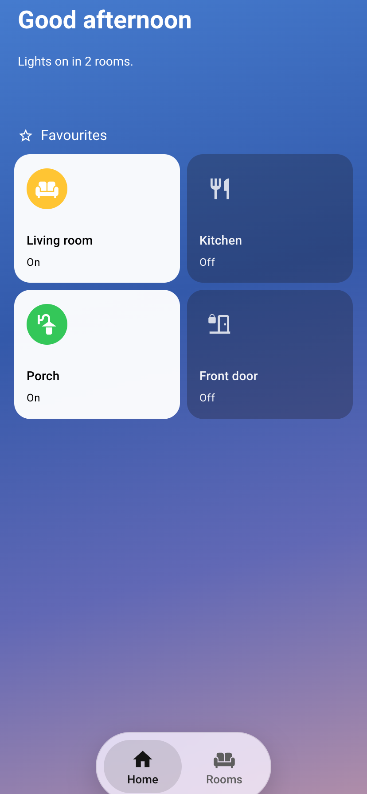
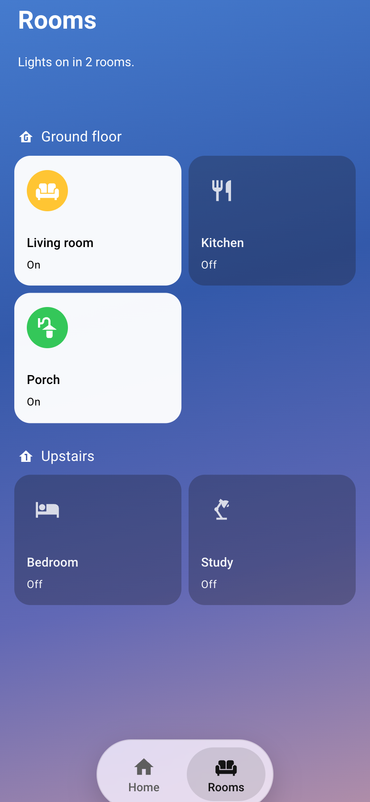
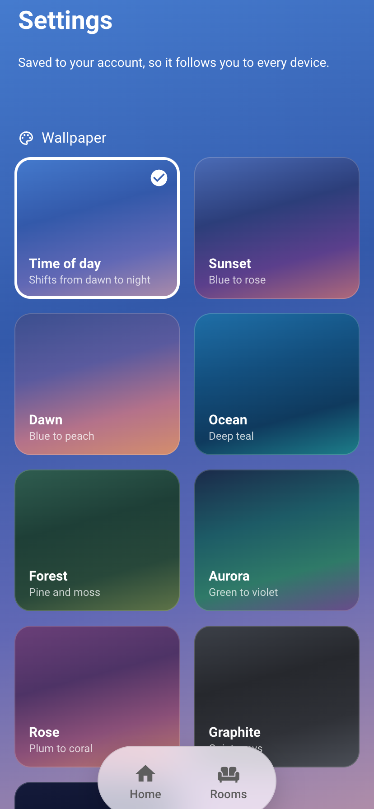

# Phone Pager Card

An iPhone-style, one-screen phone dashboard for Home Assistant: pages side by side that snap as you swipe, a frosted nav pill, a wallpaper that follows the time of day, and a build guide written for Claude.

<p align="center">
  
  
  
</p>

This README is the guide. Hand it to Claude with a Home Assistant MCP server connected, and work through the steps together. The card itself is [`phone-pager-card.js`](phone-pager-card.js) — see [Installing](#installing).

**What you end up with:**

- **One screen, four pages side by side:** Now · Home · Media · Rooms. Swipe sideways and they snap like iPhone home screens. Each page scrolls up and down on its own.
- **A floating frosted pill** at the bottom for switching pages, and no Home Assistant header bar.
- **A wallpaper gradient that follows the time of day,** from night through dawn, morning, midday, afternoon and sunset to dusk. Each person can pick a fixed one instead on a hidden Settings sheet.
- **Apple-style tiles in exactly two heights.** Tall tiles have the icon top-left and the name and status bottom-left. Compact tiles have the icon left and the text beside it. Both are frosted glass when idle, and solid white with a filled coloured icon when active or when they need attention.
- **A big white title and a one-line status** at the top of every page. The first section heading lands at exactly the same height on every page.
- **Now is contextual.** Alerts come first, then what's playing (one lock-screen-style card per speaker group), then TV, bedtime and laundry, each only while it applies. Tiles fade in and out, and everything below glides up or down to make room.
- **Health tiles** stay quiet glass until something is wrong. Then they turn white, with a red icon and a plain sentence.
- **Frosted-glass pop-ups** (Bubble Card) with clean headings. Home Assistant's own player and more-info sheets get the same frosted, white-accent look on this dashboard.
- **Pull-to-refresh,** consistent 16px spacing, and pop-ups that can open at the top and then glide to "Today".

---

## Installing

**With HACS (recommended).** In HACS, open the ⋮ menu → *Custom repositories*, add
`https://github.com/digitalmud/phone-pager-card` with type **Dashboard**, then search for *Phone Pager Card* and download it.
HACS registers the resource (`/hacsfiles/phone-pager-card/phone-pager-card.js`) for you. Reload the browser or the app
afterwards.

**By hand.** Copy [`phone-pager-card.js`](phone-pager-card.js) to `/config/www/phone-pager-card.js` on your Home Assistant,
then add a dashboard resource (Settings → Dashboards → ⋮ → Resources) with URL `/local/phone-pager-card.js` and type
**JavaScript module**. With a Home Assistant MCP server connected, Claude can add the resource for you.

Both routes give you `custom:phone-pager-card`, `custom:phone-now-playing-card` and `custom:phone-wallpaper-card`.
A minimal dashboard is one panel view holding one card:

```yaml
kiosk_mode:
  hide_header: true          # needs Kiosk Mode; leave it out to keep the header
views:
  - title: Home
    path: home
    type: panel
    cards:
      - type: custom:phone-pager-card
        start: 0
        pages:
          - name: Home
            icon: mdi:home
            sections:
              - type: grid
                cards:
                  - type: heading
                    heading: Living room
                  - type: tile
                    entity: light.living_room
          - name: Rooms
            icon: mdi:sofa
            sections: []
```

Every option the card takes is listed in [Step 3](#step-3-make-the-dashboard-one-screen). The look — glass tiles, white
headings, frosted pop-ups — comes from the card-mod recipes in the [appendix](#appendix-style-recipes-card-mod--bubble).

---

## 1. What you need

| Piece | Why |
|---|---|
| Home Assistant 2026.x on a **storage-mode** dashboard | Sections, the current tile card and heading cards are what the styling targets. |
| **HACS** | To install this card and the ones below. |
| **Bubble Card** (HACS) | Pop-ups. |
| **card-mod** (HACS) | Per-tile styling: glass, white "on" state, icon sizes, layout. |
| **Kiosk Mode** (HACS) | Hides HA's header bar on the phone dashboard. |
| **auto-entities** (HACS) | Lists built from templates: alerts, now-playing cards, "what's on this week". |
| Claude with a **Home Assistant MCP server**, e.g. [ha-mcp](https://github.com/homeassistant-ai/ha-mcp) | So Claude can read and write dashboards, resources and helpers directly. |
| Optional: a way for Claude to **screenshot** a dashboard: the **Puppet** add-on (see below), or headless Chrome logged in as a read-only user | So it can check its work instead of guessing. Strongly recommended. |

Your devices don't matter. Everything below is layout and styling, and it works with whatever rooms and entities you have.

---

## 2. How to work with Claude on this

Paste this at the start of the session:

> We're building an iPhone-style phone dashboard in Home Assistant, following the guide I'll paste below.
> Rules: (1) back up the current dashboard config to a file before any change; (2) keep the dashboard config in a
> local build script you regenerate and push as a whole, so every change is repeatable; (3) after each change,
> take a screenshot (phone size, 414×896) and look at it before telling me it's done; when something has to line
> up, MEASURE it in the browser rather than eyeballing; (4) never upload a JavaScript resource that hasn't passed
> `node --check`; (5) keep the old dashboard as a separate backup dashboard.

Then do one step at a time, and look at your phone after each one. Most of the polish came from small requests like "a bit lower" or "10px less", and from "these two should line up".

### Optional: let Claude see the dashboard with Puppet

[Puppet](https://github.com/balloob/home-assistant-addons) is a Home Assistant add-on that renders any dashboard to a PNG from a URL. With it, Claude can check each change itself instead of asking you for screenshots.

1. **Install it.** Settings → Add-ons → Add-on store → ⋮ → Repositories → add `https://github.com/balloob/home-assistant-addons`, then install **Puppet** and start it.
2. **Give it a user.** Create a separate **non-admin** Home Assistant user, e.g. `puppet`. Log in as it once, create a long-lived access token on its profile page, and paste the token into Puppet's configuration. A non-admin user keeps the screenshot tool from changing anything.
3. **Render.** Tell Claude:
   > To check your work, fetch `http://<home-assistant-ip>:10000/<dashboard>/<view>?viewport=414x896&wait=7000`
   > and look at the PNG. Use `414xauto` for the full page height. Save renders in a `renders/` folder.

**Things to know about Puppet:**

- **It renders as its own user.** Cards hidden with `user` visibility, e.g. admin-only sections, never appear in its pictures.
- **It can't open pop-ups or swipe.** A `#hash` URL returns the plain page. For pop-ups, touch gestures and timing checks, have Claude drive a headless Chrome over the DevTools protocol, logged in as the same user. That's how the swipe, pull-to-refresh and pop-up scroll here were tested.
- **It may keep old copies of inline resources** between renders. After changing the pager card's JavaScript, check in a fresh headless browser.
- **The first render after a change can miss card-mod styling.** Render twice before concluding a style didn't apply.
- **It's a desktop browser,** so it has no iPhone status bar, home indicator or safe areas, and no iOS rendering quirks. Spacing near the screen edges and anything iOS-specific (pitfall 3) still needs a look on a real phone.

---

## 3. The steps (prompts to give Claude)

### Step 1: Plan the pages
> Read my current phone dashboard and list what's on it. Propose how to split it into four pages:
> **Now** (contextual: alerts first, then music, TV, bedtime, laundry — each only while it applies),
> **Home** (greeting + status sentence, then admin/info tiles and the "systems" summary tiles),
> **Media** (library, music, downloads health, storage) and **Rooms** (every room, grouped by floor).

### Step 2: Install the pager card
Install **Phone Pager Card** from HACS (see [Installing](#installing)) and check that the resource is listed under Settings → Dashboards → ⋮ → Resources. It defines `custom:phone-pager-card` (the one-screen pager), `custom:phone-now-playing-card` and `custom:phone-wallpaper-card`.

### Step 3: Make the dashboard one screen
> Rebuild the dashboard as ONE view, `type: panel`, holding a single `custom:phone-pager-card`. Put each page's
> sections under `pages:` and every Bubble pop-up under `popups:`. Add `kiosk_mode: {hide_header: true}` at the top
> of the dashboard config. Start on Home (`start: 1`).

```yaml
kiosk_mode:
  hide_header: true          # edit later by adding ?disable_km to the URL
views:
  - title: Home
    path: home
    type: panel
    cards:
      - type: custom:phone-pager-card
        start: 1                         # 0 = Now, 1 = Home, …
        pages:
          - {name: Now,   icon: mdi:clock-outline, sections: [ ... ]}
          - {name: Home,  icon: mdi:home,          sections: [ ... ]}
          - {name: Media, icon: mdi:play-circle,   sections: [ ... ]}
          - {name: Rooms, icon: mdi:sofa,          sections: [ ... ]}
        popups: [ ...every custom:bubble-card pop-up... ]
        scroll_to:                       # optional: pop-up opens at the top, then glides to the first card starting "Today"
          "#whats-on": [Today, Tomorrow]
        # settings: false                # hides the Settings sheet
        # settings_sections: [ ... ]     # replaces what's on it
```

| Card option | What it does |
|---|---|
| `pages` | `name`, `icon`, and `sections` (normal sections-view sections; visibility rules work). |
| `popups` | Bubble pop-up cards. Each gets its own wrapper, so a closed pop-up can't hide the pager. |
| `start` | The page to open on. The last page is remembered while the app stays open. |
| `scroll_to` | Pop-up hash → words. The pop-up opens at the top, then eases to the first card whose subtitle starts with one of them. |
| `settings` / `settings_sections` | The hidden Settings sheet: on by default; replace its contents. |

To link to a page from a tile, use `navigate` to `/<dashboard>/home?page=media`. The card also provides, with no configuration:

- swipe with snapping;
- a frosted nav pill;
- pull-to-refresh;
- the time-of-day wallpaper;
- fade-in/out plus a glide for any card or section that comes and goes;
- frosted Home Assistant more-info dialogs while this dashboard is open.

### Step 4: Apple-style tiles, two heights
> Restyle every tile with card-mod using the recipes in Appendix B: 18px corners, no borders or shadows, frosted
> glass when off, solid white with a filled icon circle when on (use each tile's own "on" condition). Use exactly
> two heights: **tall** (`vertical: true`, `rows: 2.4` = 157px; icon 46px top-left, name + status bottom-left) for
> rooms, systems and media, and **compact** (`rows: 1.2` = 70px; icon left, text beside it) for alerts and small info.
> Tall tiles that hide their status line need the "no status line" fix so their name lines up with the rest.

### Step 5: Titles, status lines, headings
> Give every page a big white title the size of the Home greeting, plus a one-line status under it (a text-only
> markdown card: `# Rooms`, a blank line, then a short Jinja sentence like "Lights on in 4 rooms."). Make that title
> card the SAME fixed height on every page (112px fits a title and up to three status lines), so the first section
> heading sits at exactly the same height everywhere. Use white `heading` cards for sections (one per floor on Rooms,
> 22px extra space above each later one). No divider lines, except on dropdown (expander) headers.

### Step 6: Frosted pop-ups
> Apply the pop-up recipe in Appendix B to every Bubble pop-up: dark frosted glass, white text, translucent inner
> cards, corner radius set on the pop-up, small bottom padding. Turn every Bubble `separator` into a plain heading,
> including separators generated inside auto-entities templates. Keep pop-ups to content only — no extra headers
> that repeat the pop-up's own title.

### Step 7: The Now page
> Make Now contextual. First an **Activity** section of compact alert tiles (doors unlocked/open, smoke, CO, packages,
> low batteries), each with a visibility condition — the section hides itself when nothing applies. Under the alerts,
> music: one `custom:phone-now-playing-card` per **speaker group** (auto-entities over the speakers that are playing;
> one card per group coordinator, `group_members[0]`, named like "Kitchen + 2"). Then TV controls only while the TV
> is really on, kids' bedtime controls in the evening window, laundry while running. The status line under "Now" says
> what's going on ("The TV is on · 2 speakers playing.") or "Nothing going on right now."

Two lessons from building it:

- **Use the TV's own power state.** A streaming box (Apple TV, Chromecast) can sit on "paused" for hours after the TV is off. Use the TV itself, or "the box is playing".
- **Show music once.** Grouped speakers report "playing" on every member, so draw one card per group, and don't add a separate "playing" list on top.

### Step 8: Media
> Media gets: a wide **TV & Movies** tile (one list of this week's schedule plus recent downloads, ✓ when
> downloaded), a wide **Music** tile ("Playing in Kitchen + 2" from a template helper) opening a pop-up of
> now-playing cards for every playing or paused group, a compact **Downloads** health tile, and **Storage**.

### Step 9: Summary and health tiles
> For each "system" (climate, security, network, downloads…), create a **template helper** sensor that writes one
> plain sentence ("Front & back locked", "All good", "Downloads paused · Sonarr offline"). Show it as a tile that stays
> glass when fine and turns white with a red or coloured icon when it has something to say. Tapping opens a pop-up
> of status tiles with tap/hold set to `none`, so you don't get history graphs.

### Step 10: Per-user settings
> Check the hidden Settings sheet: from the last page, pull left (elastic, like pull-to-refresh) and it slides in;
> swipe right or tap any nav button to leave. Picking a wallpaper should repaint the background at once and survive
> a reload.

Choices are stored per user with Home Assistant's `frontend/set_user_data` (key `phone-pager`), so they follow the login, not the device. To add wallpapers, edit `PRESETS` in the card.

### Step 11: Polish to taste
These were the final numbers here. Ask for changes in plain words, like "bar 10px lower".

- **Nav pill:** buttons 88×60, 26px icons, 13px labels, 8px padding; sits at `safe-area − 8px` from the bottom.
- **Pages:** 4px top padding (HA already pads for the status bar), 16px sides, bottom `safe-area + 99px` (the last tile stops ~31px above the pill).
- **Tiles:** 16px gaps; side margin = tile gap; two heights only, 157px and 70px.
- **Type:** tile name 14px/16px semibold, status 12px/14.4px; line tops 25px apart. Custom cards match it.
- **Motion:**
  - fade out 260ms, then a 340ms glide;
  - fade in 380ms;
  - pop-up auto-scroll 1.1s ease-in-out;
  - everything off under Reduce Motion.
- **Pull-to-refresh:** triggers after ~240px of finger travel.

---

## 4. Pitfalls we hit (tell Claude up front)

1. **Bubble hides the nearest `hui-card` around a closed pop-up.** If pop-ups sit inside your own card, Bubble hides the whole card. Wrap each pop-up in its own `<hui-card>` (the pager does this).
2. **The tile icon colour is set on `ha-tile-icon` itself.** Override it inside `ha-tile-icon$ :host {}`. A filled icon circle needs the `.container` background, because the `:before` layer at full opacity covers the glyph.
3. **iOS flashes big frosted tiles white and square while a pop-up animates.** Don't put `backdrop-filter` on page tiles: over a smooth gradient it's invisible anyway. Keep blur on pop-ups and the nav pill.
4. **Tiles inside pop-ups sometimes render square.** Set `--ha-card-border-radius` on the pop-up itself instead of relying on the theme.
5. **Cards inside a stack lose their corners,** e.g. cards from auto-entities in a vertical-stack. Give each one its own `border-radius` and `overflow: hidden`.
6. **Bubble leaves ~140px plus a 66px spacer under pop-up content on phones.** Override `padding-bottom` and `--bubble-pop-up-extra-bottom-space`.
7. **Pull-to-refresh:** inside a scrolling page, the app's own pull fires on some pages and not others. Use the pager's, and make every page scroll at least 1px so the app's pull stays off (the card does this).
8. **Safe areas:** HA pads the view's top for the status bar but not its bottom. Anything you position yourself, e.g. a sheet, should be anchored to the same box as the pages, not to the screen.
9. **A dashboard-level `background` ignores gradients,** and a body background colour paints over HA's view background. Paint the wallpaper inside the card.
10. **Status templates:** if the line after a markdown title starts with `{%-`, the trim eats the blank line and the status runs onto the title. Put `{{ "" }}` in front.
11. **Tall tiles without a status line** sit their name 7.4px low. Add `.info { padding-bottom: 7.4px }` (`ha-tile-info$`).
12. **`hui-card` is `display: inline`,** so transforms on it do nothing. To animate a card's position, move its parent grid cell.
13. **HA's own dialogs:** set the variables on the dialog element itself, and set `color` there too, because inherited text colour is already resolved above it. Variables defined *in terms of* other variables at the page root (Web Awesome's `--wa-color-brand-*`, used by HA buttons) must be overridden directly; overriding what they reference does nothing.
14. **The iPhone app's edge swipe opens HA's sidebar** when you swipe back from the Settings sheet. The page can't block it: turn it off in the app under Settings → Companion App → Gestures.
15. **A `//` comment inside a one-line JS edit can swallow the rest of the line.** Always `node --check` before uploading a resource.
16. **Screenshot tools may cache inline resources,** and can't see iOS quirks. Verify resource changes in a fresh browser session, and check edges and animations on a real phone.
17. **Keep a backup dashboard** (a copy of the old one at another URL) so you can always compare or roll back.

---

---

## Appendix: Style recipes (card-mod / Bubble)

The **wallpaper** is painted by the card. To change the colours, edit the keyframes in `_paintSky()`. Preview any hour with `?sky=13.5` on the URL.

**Every page tile, base:**
```css
ha-card { --ha-card-border-radius: 18px; border: none !important; box-shadow: none !important; }
ha-card { clip-path: inset(0 round 18px); isolation: isolate; }
```

**Off / idle = glass** (no backdrop-filter, see pitfall 3):
```css
ha-card { background: rgba(28,28,40,0.32) !important;
  --primary-text-color: rgba(255,255,255,0.95); --secondary-text-color: rgba(255,255,255,0.62);
  --tile-color: rgba(255,255,255,0.8) !important; --tile-icon-color: rgba(255,255,255,0.8) !important; }
```

**On = white**, wrapped in a Jinja ` …  <glass> ` inside card-mod's `.` style:
```css
ha-card { background: rgba(255,255,255,0.96) !important;
  --primary-text-color: #000; --secondary-text-color: rgba(60,60,67,0.65);
  --tile-color: #ffc533 !important; }
```

**Filled icon circle when on** (card-mod key `ha-tile-icon$`, same condition). Use `var(--red-color)` for alerts, or `var(--tile-color)` to keep a tile's own colour:
```css
:host { --tile-icon-color: #fff !important; }
.container { background-color: #ffc533 !important; }
.container:before { opacity: 0 !important; }
```

**Tall tile layout** (`vertical: true`, `grid_options: {columns: 6, rows: 2.4}`):
```yaml
card_mod:
  style:
    .: >
      ha-card .content, ha-card .container, ha-card > div { align-items: flex-start !important; }
      ha-card .content { padding-left: 16px !important; padding-right: 16px !important; }
      ha-tile-icon { margin-inline-start: 0 !important; align-self: flex-start !important; }
      /* + base, + glass/white */
    ha-tile-info$: .info { align-items: flex-start !important; text-align: left !important; padding-inline-start: 6px !important; }
    ha-tile-icon$: ":host { --tile-icon-size: 46px !important; --mdc-icon-size: 28px !important; }"
    ha-tile-container$: .content.vertical { justify-content: space-between !important; padding-top: 16px !important; padding-bottom: 16px !important; }
```

**Compact tile** (`vertical: false`, `grid_options: {columns: 6, rows: 1.2}`): same base, glass or white, no layout overrides.

**Tall tile with no status line** (`hide_state: true`): add to the tall layout
```yaml
    ha-tile-info$: .info { align-items: flex-start !important; text-align: left !important; padding-inline-start: 6px !important; padding-bottom: 7.4px !important; }
```

**Page title + status** (text-only markdown, first section of every page):
```yaml
type: markdown
text_only: true
grid_options: {columns: full}
content: |-
  # Rooms

  {{ "" }}{{ 'Lights on in ' ~ n ~ ' rooms.' if n else 'All lights off.' }}
card_mod:
  style: "ha-card { --primary-text-color: #fff; color: #fff; height: 112px !important; box-sizing: border-box; overflow: hidden; }"
```

**Now-playing cards, one per speaker group** (auto-entities in a 1-column grid; Sonos shown, any grouping integration works the same way):
```yaml
type: custom:auto-entities
show_empty: false
card_param: cards
card: {type: grid, columns: 1, square: false}
filter:
  template: >-
    
    
    
    
    
    {{ ns.o }}
```

**White headings and page titles** on the wallpaper (heading cards and text-only markdown):
```css
ha-card { --primary-text-color: #fff; --secondary-text-color: rgba(255,255,255,.7); }
```

**Frosted Bubble pop-ups:** add to every `card_type: pop-up`:
```yaml
bg_color: rgb(22, 24, 42)
bg_opacity: '55'
bg_blur: '30'
shadow_opacity: '0'
margin_top_mobile: 20px
styles: |
  .bubble-pop-up { color: #fff;
    --primary-text-color: #fff; --secondary-text-color: rgba(255,255,255,0.65);
    --ha-card-background: rgba(255,255,255,0.10); --card-background-color: rgba(255,255,255,0.10);
    --ha-card-box-shadow: none; --ha-card-border-color: transparent;
    --state-icon-color: rgba(255,255,255,0.85); --divider-color: rgba(255,255,255,0.15);
    --bubble-main-background-color: rgba(255,255,255,0.10); --bubble-secondary-background-color: rgba(255,255,255,0.10);
    --ha-card-border-radius: 18px; --ha-border-radius-lg: 18px; }
  .bubble-pop-up, .bubble-pop-up::before, .bubble-pop-up-background {
    border-radius: 42px 42px 0 0 !important; clip-path: inset(0 round 42px 42px 0 0); }
  @media (max-width: 768px) { .bubble-pop-up-container {
    padding-bottom: calc(6px + var(--safe-area-inset-bottom, 0px)) !important;
    --bubble-pop-up-extra-bottom-space: 0px !important; } }
```

**Status tiles that shouldn't open a graph:**
```yaml
tap_action: {action: none}
icon_tap_action: {action: none}
hold_action: {action: none}
```

---

## Credits

This card stands on other people's work:

- [Bubble Card](https://github.com/Clooos/Bubble-Card) — the pop-ups.
- [card-mod](https://github.com/thomasloven/lovelace-card-mod) — per-tile styling.
- [Kiosk Mode](https://github.com/NemesisRE/kiosk-mode) — hides the header bar.
- [auto-entities](https://github.com/thomasloven/lovelace-auto-entities) — lists built from templates.
- [ha-mcp](https://github.com/homeassistant-ai/ha-mcp) — the Home Assistant MCP server Claude works through.
- [Puppet](https://github.com/balloob/home-assistant-addons) — dashboard screenshots, so Claude can check its own work.
- The r/homeassistant post that started it: [iOS inspired Home Assistant theme](https://www.reddit.com/r/homeassistant/comments/1wy5agd/ios_inspired_home_assistant_theme/).

iPhone and iOS are trademarks of Apple Inc. This project is not affiliated with or endorsed by Apple; "iPhone-style"
describes the look and nothing more.

## License

[MIT](LICENSE)
